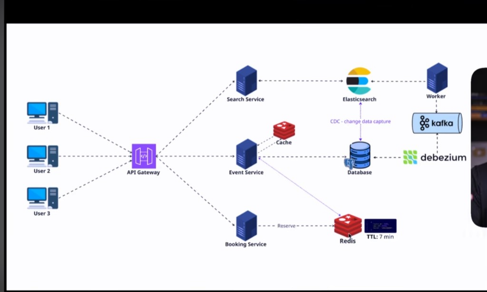

# Ticketing System

A **system design** lab: an events and ticket-reservation platform, conceptually inspired by Ticketmaster — **not a clone**.

V1 is done: a modular monolith (React + Fastify + PostgreSQL), the full flow **event → session → seat → reservation → ticket**, and a **k6** load baseline. Bottlenecks were expected. They are part of the experiment.

Redis, Elasticsearch, Debezium, and Kafka are the target architecture, added one piece at a time when the numbers justify it.

| Status | Stack | Baseline |
| --- | --- | --- |
| **V1 complete** · V2 = Redis | Vite, Fastify, Prisma, PostgreSQL 16, k6 | [monitoring/without-redis](monitoring/without-redis/) |

- [Goals](#goals)
- [Architecture](#architecture)
- [Getting started](#getting-started)
- [k6 baseline (no Redis)](#k6-baseline-no-redis)
- [Domain and API](#domain-and-api)
- [Roadmap](#roadmap)

---

## Goals

1. **Learn architecture in code**, not only on a whiteboard. Spec first ([`specs/ticketing-system-plan-v1.md`](specs/ticketing-system-plan-v1.md)), then implementation.
2. **Ship a real minimum product**: list events, pick a session, reserve seats, confirm a ticket.
3. **Measure before optimizing.** Each k6 run becomes a report under `monitoring/` (median, p95/p99, VUs, req/s). No Redis in V1 on purpose.
4. **Evolve when the numbers ask for it.** Redis, Elasticsearch, Debezium, and Kafka land one at a time, with the same tests re-run for comparison.

This repo is **not** a production SaaS, a faithful Ticketmaster clone, or a forever-monolith. It is a versioned lab.

---

## Architecture

### Today (V1)

```
Frontend (Vite + React)
        ↓ HTTP
Backend (Fastify, modular monolith)
        ↓ SQL
PostgreSQL
```

One Fastify process, organized by domain (`events`, `sessions`, `seats`, `reservations`, `tickets`). No cache, queue, search engine, or microservices. Seat concurrency is the unique `(sessionId, seatId)` constraint in Postgres.

### Target (system design)

The diagram below is the **north star** — it is not all in code yet. V2 starts with Redis (event-read cache + reservation hold with TTL).



| Block | Role |
| --- | --- |
| **API Gateway** | Single entry point; routes to Search, Event, and Booking |
| **Search** | Queries **Elasticsearch** |
| **Event** | Catalog; Redis cache on hot reads |
| **Booking** | Reservations; Redis hold with **TTL** (7 min in the diagram) |
| **PostgreSQL** | Source of truth |
| **Debezium → Kafka → Worker** | CDC: database changes feed the search index |

Each piece lands when the baseline shows the matching bottleneck. Future reports: [`monitoring/with-redis/`](monitoring/with-redis/).

---

## Getting started

Prerequisites: **Node 20+**, **pnpm 9+**, **Docker** (PostgreSQL). **k6** is only needed for load tests.

```bash
pnpm install

# database
pnpm db:up
# on WSL without a docker binary: docker.exe compose up -d postgres

pnpm db:migrate
pnpm db:seed

# API :3000 · web :5173
pnpm dev
```

Copy [`.env.example`](.env.example) if you need to override defaults. The API reads `apps/api/.env`.

```bash
pnpm test          # critical API flows
pnpm db:studio     # Prisma Studio on :5555
```

### Layout

```
apps/api          Fastify + Prisma
apps/web          Vite + React
load-tests/       k6 scripts
monitoring/       load reports (with / without Redis)
docs/images/      system design
specs/            V1 spec
```

---

## k6 baseline (no Redis)

Machine: WSL2, 8 vCPU, 7.7 GiB RAM · k6 v0.57.0 · **20 s** per load · 2026-08-26.

On WSL the clock sometimes jumps: ignore absurd `avg`/`max` values and use **median** and **p95**. Full write-ups live under [`monitoring/without-redis/`](monitoring/without-redis/). Protocol: [`monitoring/README.md`](monitoring/README.md).

Times in **ms**. Failure = transport error (a 409 for a taken seat is **not** an HTTP failure).

### `GET /events`

Catalog with venue and **all** sessions. No pagination. Every listing hits Postgres.

| VUs | Requests | req/s | med | p95 | p99 | Failures |
| ---: | ---: | ---: | ---: | ---: | ---: | ---: |
| 10 | 1880 | 93.7 | 5.3 | 8.4 | 15.5 | 0% |
| 50 | 9029 | ~450 | 6.5 | 34.1 | 65.7 | 0% |
| 100 | 14328 | ~716 | 27.9 | 125 | 222 | 0% |
| 500 | 18479 | 903 | 216 | 395 | 12326 | 0% |
| 1000 | 18621 | 835 | 438 | 1007 | 22021 | 0% |

Through 50 VUs, p95 is still low. At 500–1000 VUs throughput **does not scale** (903 → 835 req/s): the server stays up, it just gets slow. V2 candidates: Redis cache for the listing + a slimmer payload (the home page does not need every session).

Details: [`monitoring/without-redis/events.md`](monitoring/without-redis/events.md).

### `GET /sessions/:id/seats`

192 seats + lazy expiry on the request path. Already slower than `/events` at 10 VUs.

| VUs | Requests | req/s | med | p95 | p99 | Failures |
| ---: | ---: | ---: | ---: | ---: | ---: | ---: |
| 10 | 1775 | 85.4 | 10.2 | 17.3 | 34.3 | 0% |
| 50 | 5403 | 268 | 71.3 | 175 | 233 | 0% |
| 100 | 5613 | 270 | 235 | 427 | 2041 | 0% |
| 500 | 6126 | 270 | 644 | 20710 | 22450 | 0% |
| 1000 | 6520 | 194 | 969 | 25182 | 29328 | 0.15% |

Throughput plateaus around ~270 req/s from 50–100 VUs. At 1000 VUs, connection timeouts appear. Redis candidate: a short-TTL snapshot of session availability.

Details: [`monitoring/without-redis/seats.md`](monitoring/without-redis/seats.md).

### `POST /sessions/:id/reservations`

Each iteration: GET seats → POST reservation (1–2 seats). Full seed **before each load**. `created` caps around ~150: venue inventory (192 seats), not API capacity.

| VUs | HTTP reqs | req/s | med | p95 | HTTP fail | created | conflicts |
| ---: | ---: | ---: | ---: | ---: | ---: | ---: | ---: |
| 10 | 2800 | 140 | 19 | 47 | 0.9% | 85% (144) | 15% (25) |
| 50 | 3932 | 195 | 200 | 280 | 3.1% | 56% (153) | 44% (122) |
| 100 | 3523 | ~176 | 514 | 705 | 5.3% | 44% (147) | 56% (188) |
| 500 | 2937 | 116 | 4244 | 6954 | 10.1% | 34% (151) | 66% (297) |
| 1000 | 4090 | 115 | 8048 | 10779 | 46.3% | 7% (152) | 16% (330) |

The unique constraint prevents overselling: 409 is a real race, not a bug. At 1000 VUs almost half of the requests never reach the database (`dial` / timeout).

Details: [`monitoring/without-redis/reservations.md`](monitoring/without-redis/reservations.md).

### How to re-run

```bash
k6 run -e VUS=10 -e DURATION=20s load-tests/events.js
k6 run -e VUS=10 -e DURATION=20s load-tests/seats.js

pnpm db:seed   # clean inventory before each reservation load
k6 run -e VUS=10 -e DURATION=20s load-tests/reservations.js
```

Variables: `BASE_URL`, `VUS`, `DURATION`, `SESSION_ID`, `USER_IDS`.

---

## Domain and API

```
User
Event  →  Session  →  Venue
                       ↓
                      Seat

Reservation (PENDING | CONFIRMED | CANCELLED | EXPIRED)
  └── ReservationSeat  UNIQUE (sessionId, seatId)
Ticket                 UNIQUE (sessionId, seatId)
```

`PENDING` reservations expire **lazily** (`RESERVATION_TTL_SECONDS=600`). No worker and no Redis TTL — that changes in V2.

V1 auth: `x-user-id` header (no JWT). Seed: user Ana `11111111-1111-4111-a111-111111111111`, session Noite Elétrica `44444444-4444-4444-a444-444444444441`.

| Method | Route |
| --- | --- |
| `GET` | `/health` `/users` `/venues` `/events` `/events/:id` `/sessions/:id` `/sessions/:id/seats` `/reservations/:id` `/tickets/:id` |
| `POST` | `/events` `/events/:id/sessions` `/sessions/:id/reservations` `/reservations/:id/confirm` |
| `PATCH` / `DELETE` | `/events/:id` · cancel reservation |

Flow: list → session → seat map (`available \| held \| sold`) → `PENDING` → confirm issues a `Ticket`. Unique violation → `409`.

---

## Roadmap

| Version | What | Why (from the baseline) |
| --- | --- | --- |
| **V1** | Monolith + Postgres | Product and measurement. Done. |
| **V2** | Redis: cache `GET /events` + reservation hold/TTL | Listing and seat map saturate the DB; lazy expiry sits on the request path |
| **V3+** | Kafka, Elasticsearch, Debezium/CDC, gateway | Search, decoupling, and projection — when reads/index need it |

V1 choices (deliberately simple): Fastify instead of Nest, Vite instead of Next, unique constraint instead of pessimistic locking, Prisma only on the API.

---

## License

[MIT](LICENSE) © Hugo Fortunato
